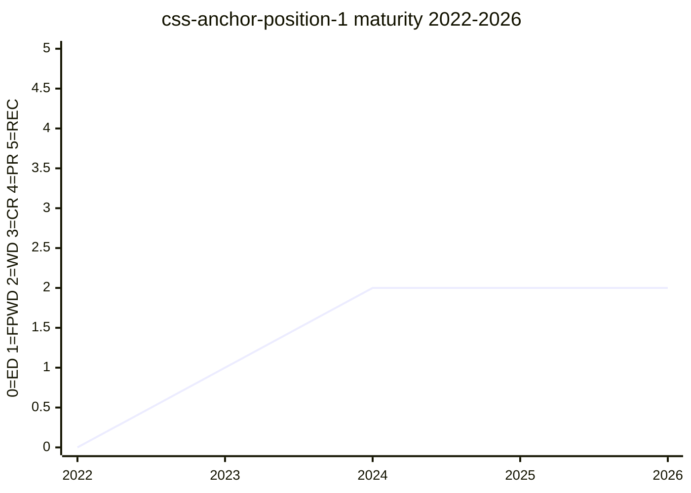

# CSS Anchor Positioning Module Level 1

Defines tethering an absolutely-positioned element to anchor element(s) — `anchor-name`,
`position-anchor`, the `anchor()`/`anchor-size()` functions, `position-area`, `@position-try`
/ `position-try-fallbacks`, and `position-visibility`. The spec vehicle for the
[anchor-positioning](../features/anchor-positioning.md) feature.

## Status history

From `raw/data/w3c-api/specifications/css-anchor-position-1.json` (snapshot 2026-07-04):

| Date | Status | TR version |
|---|---|---|
| 2023-06-29 | First Public Working Draft | https://www.w3.org/TR/2023/WD-css-anchor-position-1-20230629/ |
| 2024-03-14 | Working Draft | https://www.w3.org/TR/2024/WD-css-anchor-position-1-20240314/ |
| 2025-05-09 | Working Draft | https://www.w3.org/TR/2025/WD-css-anchor-position-1-20250509/ |
| 2026-03-27 | Working Draft | https://www.w3.org/TR/2026/WD-css-anchor-position-1-20260327/ |

The spec has stayed a Working Draft with frequent republication (nine TR versions
2023–2026) while implementation ran ahead: Chrome 125 shipped in May 2024, before the
`inset-area` → `position-area` rename ([#10209](https://github.com/w3c/csswg-drafts/issues/10209))
had even landed. Anchor positioning is an Interop 2025/2026 focus area.

## Features tracked here

- [anchor-positioning](../features/anchor-positioning.md)

---

*This page is an unofficial, LLM-maintained synthesis. It is not a product of
the CSS Working Group. Verify against the linked primary sources.*
