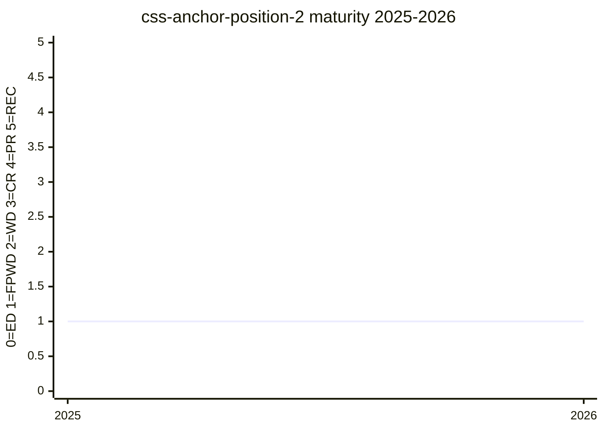

# CSS Anchor Positioning Module Level 2

The Level 2 diff spec for [anchor-positioning](../features/anchor-positioning.md), created to
hold features too experimental or too late for Level 1. Its centerpiece is querying an anchored
element's state — `container-type: anchored` plus an `anchored()` `@container` query with a
`fallback` feature, so descendants can style themselves by which fallback position was chosen
([#12390](https://github.com/w3c/csswg-drafts/issues/12390),
[#12391](https://github.com/w3c/csswg-drafts/issues/12391)). It also gathers the `::tether`
pseudo-element ([#9271](https://github.com/w3c/csswg-drafts/issues/9271)), anchoring to a
pointer/fragment, `position-anchor-name`/`position-anchor-box` longhands
([#8895](https://github.com/w3c/csswg-drafts/issues/8895)), and "magic" position animations.

## Status history

From `raw/data/w3c-api/specifications/css-anchor-position-2.json` (snapshot 2026-07-04):

| Date | Status | TR version |
|---|---|---|
| 2025-10-21 | First Public Working Draft | https://www.w3.org/TR/2025/WD-css-anchor-position-2-20251021/ |

The Level 2 split was resolved 2025-08-13 ([#12390](https://github.com/w3c/csswg-drafts/issues/12390))
and reached FPWD two months later. Note that some Level 2 features (e.g. taking transforms into
account) were later pulled *back* into Level 1 once the WG committed to them
([#8584](https://github.com/w3c/csswg-drafts/issues/8584)).

## Features tracked here

- [anchor-positioning](../features/anchor-positioning.md)

---

*This page is an unofficial, LLM-maintained synthesis. It is not a product of
the CSS Working Group. Verify against the linked primary sources.*
