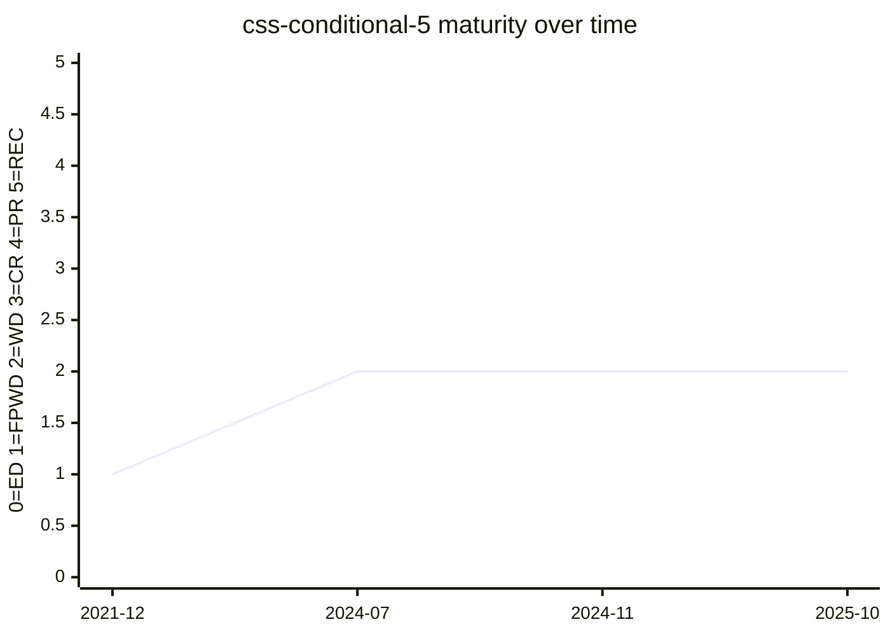

# CSS Conditional Rules Module Level 5

Level 5 of the Conditional Rules module. It extends `@supports` (feature/selector/at-rule tests)
and — since a 2024 reorganization — is the **host of container queries**: the `@container` rule,
`container-type` / `container-name`, size queries, `style()` queries, and the growing
`scroll-state()` family. Container queries were incubated in
[css-contain-3](https://drafts.csswg.org/css-contain-3/) and moved here in
[#10433](https://github.com/w3c/csswg-drafts/issues/10433#issuecomment-2165558965); this page
tracks the [container-queries](../features/container-queries.md) feature specifically, not the
module's `@supports` surface.

## Status history

From `raw/data/w3c-api/specifications/css-conditional-5.json` (snapshot 2026-07-04):

| Date | Status | TR version |
|---|---|---|
| 2021-12-21 | First Public Working Draft | https://www.w3.org/TR/2021/WD-css-conditional-5-20211221/ |
| 2024-07-23 | Working Draft | https://www.w3.org/TR/2024/WD-css-conditional-5-20240723/ |
| 2024-11-05 | Working Draft | https://www.w3.org/TR/2024/WD-css-conditional-5-20241105/ |
| 2025-10-30 | Working Draft | https://www.w3.org/TR/2025/WD-css-conditional-5-20251030/ |

Published at FPWD in December 2021 and still a Working Draft. The multi-year gap between FPWD and
the next WD (mid-2024) brackets the period when container queries were being absorbed into this
module from `css-contain-3`; the 2024–2025 republications reflect that consolidation and the
addition of scroll-state queries.

## Features tracked here

- [container-queries](../features/container-queries.md) — `@container`, size / style /
  scroll-state queries, and container units.

---

*This page is an unofficial, LLM-maintained synthesis. It is not a product of
the CSS Working Group. Verify against the linked primary sources.*
