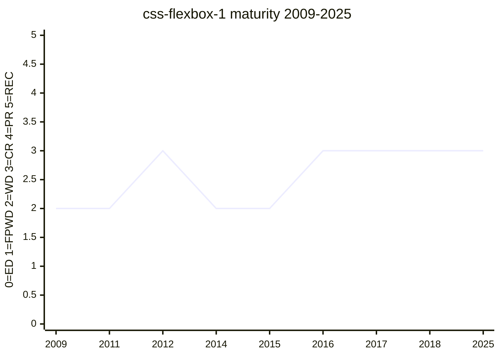

# CSS Flexible Box Layout Module Level 1

One-dimensional flexible layout (`display: flex`), descended from the XUL box model.
Hosts the `flex` shorthand and its longhands, whose design story is tracked in
[flex-shorthand](../features/flex-shorthand.md). The 2012 rewrite era (Hamburg F2F
longhand split, `0 1 auto` initial value, LC → CR) is where the module's author-facing
surface stabilised.

## Status history

From `raw/data/w3c-api/specifications/css-flexbox-1.json` (snapshot 2026-07-04). Early
versions used the `css3-flexbox` shortname:

| Date | Status | TR version |
|---|---|---|
| 2009-07-23 | Working Draft | https://www.w3.org/TR/2009/WD-css3-flexbox-20090723/ |
| 2011-03-22 | Working Draft | https://www.w3.org/TR/2011/WD-css3-flexbox-20110322/ |
| 2011-11-29 | Working Draft | https://www.w3.org/TR/2011/WD-css3-flexbox-20111129/ |
| 2012-03-22 | Working Draft | https://www.w3.org/TR/2012/WD-css3-flexbox-20120322/ |
| 2012-06-12 | Last Call Working Draft | https://www.w3.org/TR/2012/WD-css3-flexbox-20120612/ |
| 2012-09-18 | Candidate Recommendation Snapshot | https://www.w3.org/TR/2012/CR-css3-flexbox-20120918/ |
| 2014-03-25 | Last Call Working Draft | https://www.w3.org/TR/2014/WD-css-flexbox-1-20140325/ |
| 2014-09-25 | Last Call Working Draft | https://www.w3.org/TR/2014/WD-css-flexbox-1-20140925/ |
| 2015-05-14 | Last Call Working Draft | https://www.w3.org/TR/2015/WD-css-flexbox-1-20150514/ |
| 2016-03-01 | Candidate Recommendation Snapshot | https://www.w3.org/TR/2016/CR-css-flexbox-1-20160301/ |
| 2016-05-26 | Candidate Recommendation Snapshot | https://www.w3.org/TR/2016/CR-css-flexbox-1-20160526/ |
| 2017-10-19 | Candidate Recommendation Snapshot | https://www.w3.org/TR/2017/CR-css-flexbox-1-20171019/ |
| 2018-11-08 | Candidate Recommendation Snapshot | https://www.w3.org/TR/2018/CR-css-flexbox-1-20181108/ |
| 2018-11-19 | Candidate Recommendation Snapshot | https://www.w3.org/TR/2018/CR-css-flexbox-1-20181119/ |
| 2025-10-14 | Candidate Recommendation Draft | https://www.w3.org/TR/2025/CRD-css-flexbox-1-20251014/ |

The 2014–2015 dip is real: the spec dropped from CR back to Last Call twice before
returning to CR in 2016. The omitted-`flex-basis` `0%` → `0` change is recorded in the
spec's own "changes since 14 May 2015" substantive-changes list and is still contested
in [#5742](https://github.com/w3c/csswg-drafts/issues/5742). Universally shipped for over a decade, yet never REC — a common CSS pattern.

## Features tracked here

- [flex-shorthand](../features/flex-shorthand.md)

---

*This page is an unofficial, LLM-maintained synthesis. It is not a product of
the CSS Working Group. Verify against the linked primary sources.*
