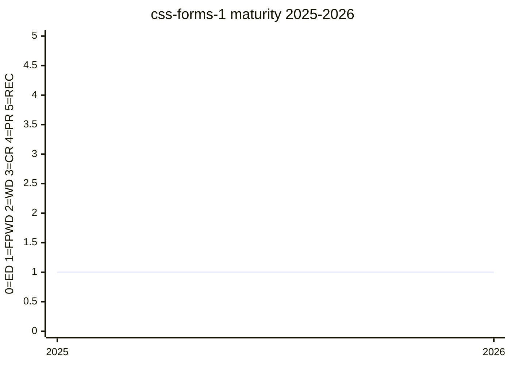

# CSS Form Control Styling Level 1

The module that defines how authors opt form controls into interoperable, fully
stylable rendering — `appearance: base` / `base-select` — and the vocabulary of
part pseudo-elements that opt-in exposes: `::picker()`, `::picker-icon`,
`::checkmark`, `::field-content` (with `::field-component` / `::field-separator`),
`::slider-thumb` / `::slider-track` / `::slider-fill`, `::color-swatch`,
`::clear-icon` / `::reveal-icon`, plus the `control-value()` function and the
base-appearance UA stylesheet itself. It is the CSSWG's landing zone for the
[customizable `<select>`](../features/customizable-select.md) work that started
in the Open UI CG, and the styling counterpart of the WHATWG HTML changes merged
in 2025 ([whatwg/html#10548](https://github.com/whatwg/html/pull/10548)).

The `[css-forms]` label long predates the module: issues carry it from 2017
([#1685](https://github.com/w3c/csswg-drafts/issues/1685)), and an unofficial
"ideas" document sat at the css-forms-1 URL for years — the 2024-09-19 minutes
record [fantasai](../people/fantasai.md) as saying "there is, in the CSSWG repo,
a document with ideas at css-forms-1. We could take over that document and put
these principles there"
([#10866](https://github.com/w3c/csswg-drafts/issues/10866#issuecomment-2361365895)).
The module proper was adopted at that meeting, with [fantasai](../people/fantasai.md) and
[nt1m](../people/nt1m.md) (whose WebKit-internal draft seeded it) as editors:

> RESOLVED: add the principles and examples of use to css-forms-1

> RESOLVED: add fantasai and ntim as editors of css-forms-1

— 2024-09-19, [#10866](https://github.com/w3c/csswg-drafts/issues/10866#issuecomment-2361365895)

FPWD was resolved 2025-03-19
([#6900](https://github.com/w3c/csswg-drafts/issues/6900#issuecomment-2737246908))
after a joint CSSWG/WHATWG/Open UI review week that produced ~50 issues
(meta: [#11854](https://github.com/w3c/csswg-drafts/issues/11854)). As of the
2026-08 sync the label carries 78 resolutions; the 2026 pattern is a
resolution-by-resolution buildout of the base UA stylesheet (overflow, typography,
box-sizing, centering, a11y semantics) driven largely by [fantasai](../people/fantasai.md)'s issue batches.

## Status history

From `raw/data/w3c-api/specifications/css-forms-1.json` (snapshot 2026-07-04):

| Date | Status | TR version |
|---|---|---|
| 2025-03-25 | First Public Working Draft | https://www.w3.org/TR/2025/WD-css-forms-1-20250325/ |

## Features tracked here

- [customizable-select](../features/customizable-select.md) — the flagship consumer
  of `appearance: base-select`, `::picker(select)`, `::picker-icon`, `::checkmark`,
  `::field-content`

Adjacent primitives specified here but broader than any one feature: the slider
pseudo-elements (adopted via [#4410](https://github.com/w3c/csswg-drafts/issues/4410),
naming settled in [#9830](https://github.com/w3c/csswg-drafts/issues/9830)),
`control-value()` (accepted 2025-04-03,
[#7869](https://github.com/w3c/csswg-drafts/issues/7869); meta
[#14140](https://github.com/w3c/csswg-drafts/issues/14140)), and `::color-swatch`
([#11837](https://github.com/w3c/csswg-drafts/issues/11837),
[#12142](https://github.com/w3c/csswg-drafts/issues/12142)). Related but living
elsewhere: `accent-color` and `field-sizing` (both css-ui-4).

---

*This page is an unofficial, LLM-maintained synthesis. It is not a product of
the CSS Working Group. Verify against the linked primary sources.*
