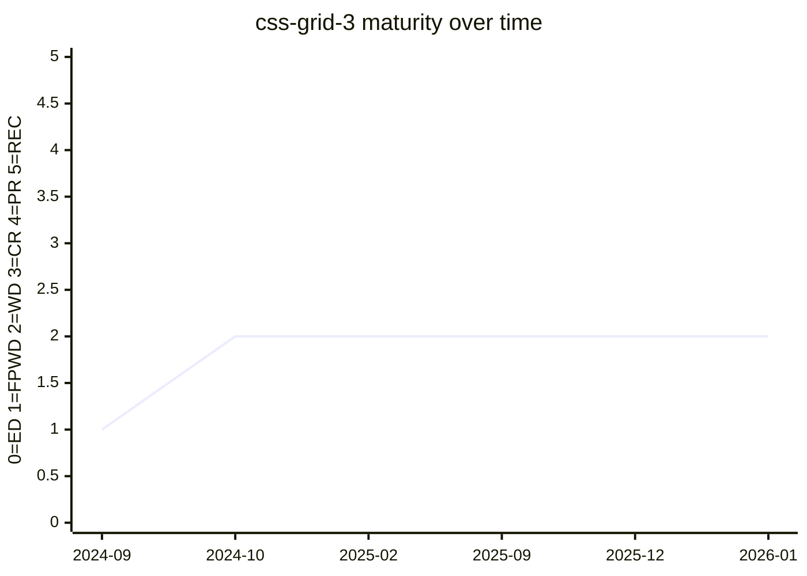

# CSS Grid Layout Module Level 3

Grid Level 3 is, in practice, the **masonry** module — it defines masonry (a.k.a. waterfall /
brick) layout as an extension of Grid, switched on by `display: grid-lanes`. It is the spec
vehicle for the [masonry](../features/masonry.md) feature. A 2026-01-29 resolution kept masonry
in this module rather than spinning out a separate `css-masonry`
([#13115](https://github.com/w3c/csswg-drafts/issues/13115#issuecomment-3820644949)).

## Status history

From `raw/data/w3c-api/specifications/css-grid-3.json` (snapshot 2026-07-04):

| Date | Status | TR version |
|---|---|---|
| 2024-09-19 | First Public Working Draft | https://www.w3.org/TR/2024/WD-css-grid-3-20240919/ |
| 2024-10-03 | Working Draft | https://www.w3.org/TR/2024/WD-css-grid-3-20241003/ |
| 2025-02-07 | Working Draft | https://www.w3.org/TR/2025/WD-css-grid-3-20250207/ |
| 2025-09-17 | Working Draft | https://www.w3.org/TR/2025/WD-css-grid-3-20250917/ |
| 2025-12-16 | Working Draft | https://www.w3.org/TR/2025/WD-css-grid-3-20251216/ |
| 2025-12-23 | Working Draft | https://www.w3.org/TR/2025/WD-css-grid-3-20251223/ |
| 2026-01-21 | Working Draft | https://www.w3.org/TR/2026/WD-css-grid-3-20260121/ |

The spec debuted at FPWD in September 2024 and moved to Working Draft within weeks; it has
re-published as WD repeatedly since (six WD versions through 2026-01), reflecting the still-active
syntax churn rather than any maturity advance.

## Features tracked here

- [masonry](../features/masonry.md) — masonry / `display: grid-lanes` layout.

---

*This page is an unofficial, LLM-maintained synthesis. It is not a product of
the CSS Working Group. Verify against the linked primary sources.*
