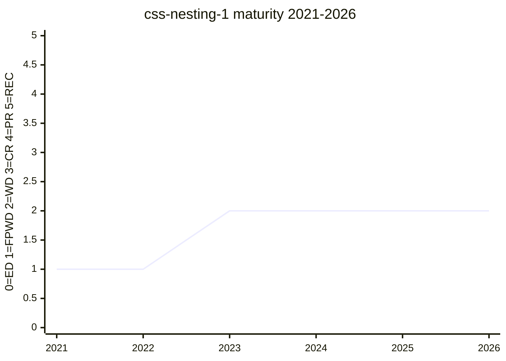

# CSS Nesting Module Level 1

Defines the syntax and semantics for nesting style rules inside other style
rules — the spec vehicle for the [css-nesting](../features/css-nesting.md) feature.

## Status history

From `raw/data/w3c-api/specifications/css-nesting-1.json` (snapshot 2026-07-04):

| Date | Status | TR version |
|---|---|---|
| 2021-08-31 | First Public Working Draft | https://www.w3.org/TR/2021/WD-css-nesting-1-20210831/ |
| 2023-02-14 | Working Draft | https://www.w3.org/TR/2023/WD-css-nesting-1-20230214/ |
| 2026-01-22 | Working Draft | https://www.w3.org/TR/2026/WD-css-nesting-1-20260122/ |

Note the spec is still a Working Draft even though every engine ships it —
a common CSS pattern where implementation outpaces /TR/ maturity. The
2025-09-03 resolution to publish a new WD came from the css-2026 "Rough
Interop" triage ([#12704](https://github.com/w3c/csswg-drafts/issues/12704)).

## Features tracked here

- [css-nesting](../features/css-nesting.md)

---

*This page is an unofficial, LLM-maintained synthesis. It is not a product of
the CSS Working Group. Verify against the linked primary sources.*
