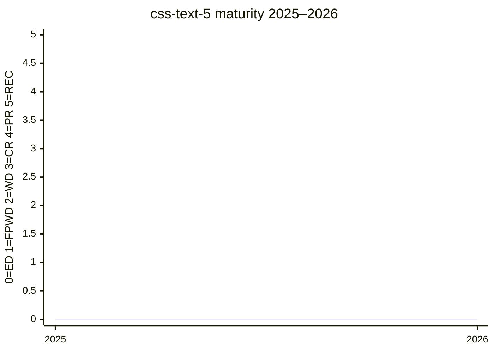

# CSS Text Module Level 5

An Editor's Draft for text-layout features introduced after
[CSS Text Level 4](https://www.w3.org/TR/css-text-4/). It currently contains the
[`text-fit`](../features/text-fit.md) property, which was moved here from Fonts 5 by the
2025-11-13 CSSWG resolution
([#12885](https://github.com/w3c/csswg-drafts/issues/12885#issuecomment-3524545760)).

Level 5 has not yet been published on the W3C Technical Reports track. Its status is therefore
ED-only and there is no `raw/data/w3c-api/specifications/css-text-5.json` status snapshot.
The first specification text was merged on 2026-04-20
([PR #13616](https://github.com/w3c/csswg-drafts/pull/13616)); the current Editor's Draft is
dated 2026-06-04.

## Status history

| Date | Status | TR version |
|---|---|---|
| 2026-04-20 | Editor's Draft only (`text-fit` initial text merged) | — |

No FPWD has been published. The dated value in frontmatter records the Editor's Draft date, not
a TR publication date.

## Features tracked here

- [Text Fitting (`text-fit`)](../features/text-fit.md)

---

*This page is an unofficial, LLM-maintained synthesis. It is not a product of
the CSS Working Group. Verify against the linked primary sources.*
