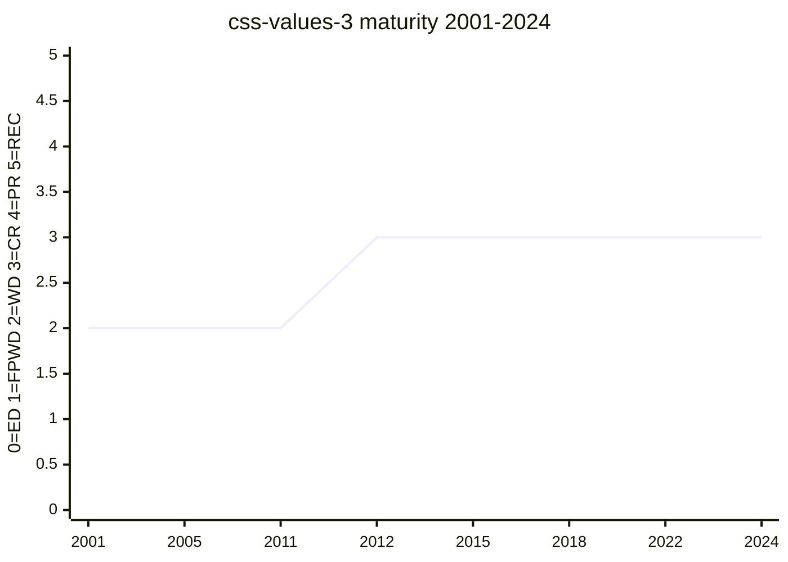

# CSS Values and Units Module Level 3

Defines the value types shared across CSS — lengths, percentages, `calc()`, and the
absolute-length system that anchors [absolute-lengths](../features/absolute-lengths.md).
The `#708` reworking of the absolute-lengths section landed against this module.

## Status history

From `raw/data/w3c-api/specifications/css-values-3.json` (snapshot 2026-07-04). Early
versions used the `css3-values` shortname:

| Date | Status | TR version |
|---|---|---|
| 2001-07-13 | Working Draft | https://www.w3.org/TR/2001/WD-css3-values-20010713/ |
| 2005-07-26 | Working Draft | https://www.w3.org/TR/2005/WD-css3-values-20050726 |
| 2006-09-19 | Working Draft | https://www.w3.org/TR/2006/WD-css3-values-20060919 |
| 2011-09-06 | Working Draft | https://www.w3.org/TR/2011/WD-css3-values-20110906/ |
| 2012-03-08 | Last Call Working Draft | https://www.w3.org/TR/2012/WD-css3-values-20120308/ |
| 2012-08-28 | Candidate Recommendation Snapshot | https://www.w3.org/TR/2012/CR-css3-values-20120828/ |
| 2013-04-04 | Candidate Recommendation Snapshot | https://www.w3.org/TR/2013/CR-css3-values-20130404/ |
| 2013-07-30 | Candidate Recommendation Snapshot | https://www.w3.org/TR/2013/CR-css3-values-20130730/ |
| 2015-06-11 | Candidate Recommendation Snapshot | https://www.w3.org/TR/2015/CR-css-values-3-20150611/ |
| 2016-09-29 | Candidate Recommendation Snapshot | https://www.w3.org/TR/2016/CR-css-values-3-20160929/ |
| 2018-08-14 | Candidate Recommendation Snapshot | https://www.w3.org/TR/2018/CR-css-values-3-20180814/ |
| 2019-01-31 | Candidate Recommendation Snapshot | https://www.w3.org/TR/2019/CR-css-values-3-20190131/ |
| 2019-06-06 | Candidate Recommendation Snapshot | https://www.w3.org/TR/2019/CR-css-values-3-20190606/ |
| 2022-12-01 | Candidate Recommendation Snapshot | https://www.w3.org/TR/2022/CR-css-values-3-20221201/ |
| 2024-03-22 | Candidate Recommendation Draft | https://www.w3.org/TR/2024/CRD-css-values-3-20240322/ |

A long-lived module: WD since 2001, in CR/CRD since 2012 without reaching REC — a
common CSS pattern where a foundational spec stays at CR while the platform depends on
it. (2012 briefly passed through Last Call Working Draft before its first CR.)

## Features tracked here

- [absolute-lengths](../features/absolute-lengths.md)

---

*This page is an unofficial, LLM-maintained synthesis. It is not a product of
the CSS Working Group. Verify against the linked primary sources.*
