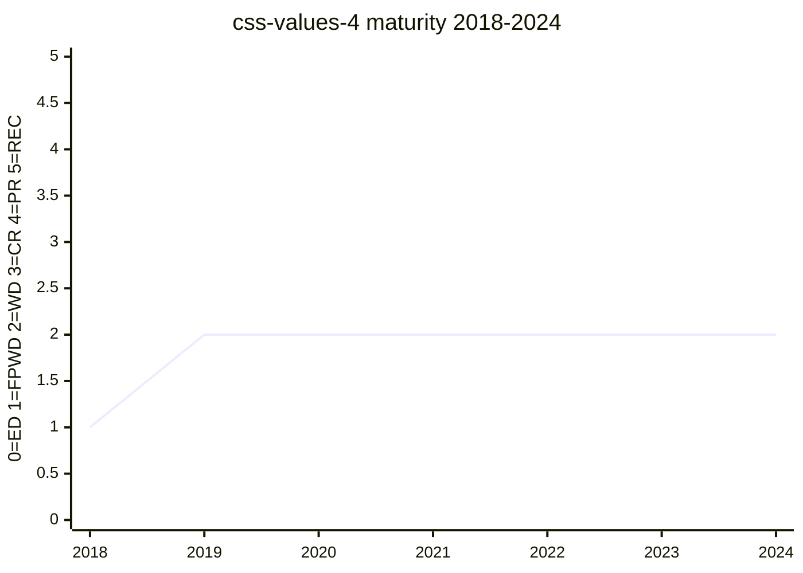

# CSS Values and Units Module Level 4

The current editor's draft carrying the value-type definitions forward from
[css-values-3](css-values-3.md), including the absolute-length / reference-pixel prose
that [absolute-lengths](../features/absolute-lengths.md) is built on. The
[#5221](https://github.com/w3c/csswg-drafts/issues/5221) challenge to the reference-pixel
definition was filed against this level.

## Status history

From `raw/data/w3c-api/specifications/css-values-4.json` (snapshot 2026-07-04):

| Date | Status | TR version |
|---|---|---|
| 2018-08-14 | First Public Working Draft | https://www.w3.org/TR/2018/WD-css-values-4-20180814/ |
| 2018-10-10 | Working Draft | https://www.w3.org/TR/2018/WD-css-values-4-20181010/ |
| 2019-01-31 | Working Draft | https://www.w3.org/TR/2019/WD-css-values-4-20190131/ |
| 2020-11-11 | Working Draft | https://www.w3.org/TR/2020/WD-css-values-4-20201111/ |
| 2021-07-15 | Working Draft | https://www.w3.org/TR/2021/WD-css-values-4-20210715/ |
| 2021-09-30 | Working Draft | https://www.w3.org/TR/2021/WD-css-values-4-20210930/ |
| 2021-10-16 | Working Draft | https://www.w3.org/TR/2021/WD-css-values-4-20211016/ |
| 2021-12-16 | Working Draft | https://www.w3.org/TR/2021/WD-css-values-4-20211216/ |
| 2022-10-19 | Working Draft | https://www.w3.org/TR/2022/WD-css-values-4-20221019/ |
| 2023-04-06 | Working Draft | https://www.w3.org/TR/2023/WD-css-values-4-20230406/ |
| 2023-10-27 | Working Draft | https://www.w3.org/TR/2023/WD-css-values-4-20231027/ |
| 2023-12-18 | Working Draft | https://www.w3.org/TR/2023/WD-css-values-4-20231218/ |
| 2024-03-12 | Working Draft | https://www.w3.org/TR/2024/WD-css-values-4-20240312/ |

FPWD in 2018, Working Draft ever since — Level 4 accumulates new value features on top
of the stable Level 3 core.

## Features tracked here

- [absolute-lengths](../features/absolute-lengths.md)

---

*This page is an unofficial, LLM-maintained synthesis. It is not a product of
the CSS Working Group. Verify against the linked primary sources.*
