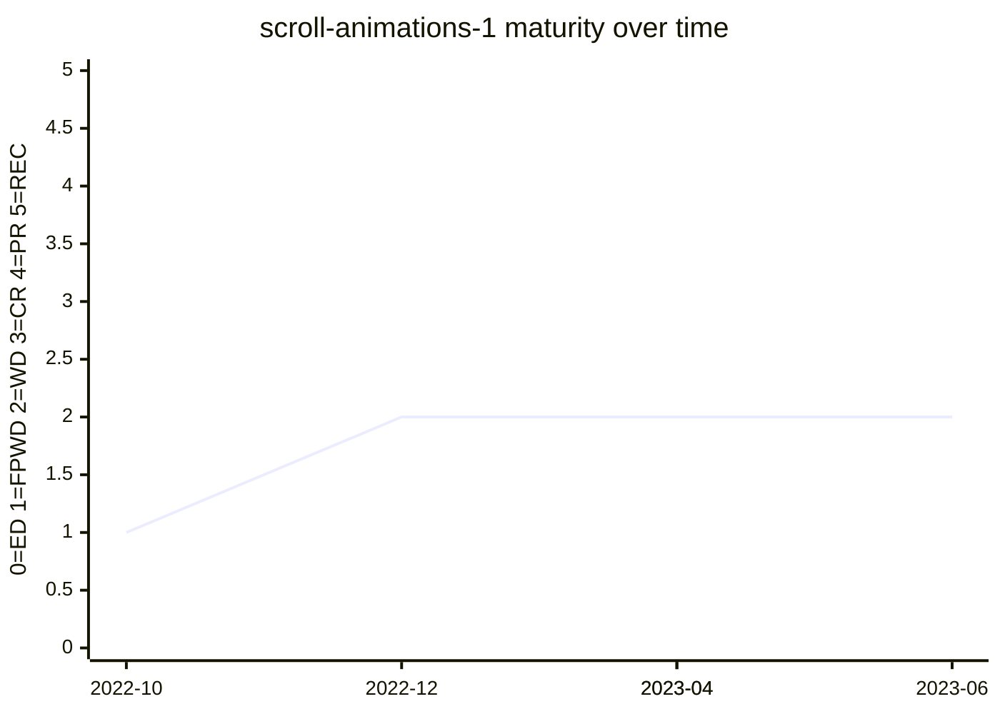

# Scroll-driven Animations

The module that defines **scroll timelines** and **view timelines** and the `animation-timeline`
machinery that binds a CSS animation to scroll progress. It began as the WICG *ScrollTimeline*
effort, moved into `csswg-drafts` in 2019, and was rebooted around a declarative
element-oriented syntax in 2021. It is the spec vehicle for the
[Scroll-driven Animations](../features/scroll-driven-animations.md) feature. Much of the
`animation-timeline` / `animation-range` surface is shared with Web Animations and CSS
Animations 2.

## Status history

From `raw/data/w3c-api/specifications/scroll-animations-1.json` (snapshot 2026-07-04):

| Date | Status | TR version |
|---|---|---|
| 2022-10-25 | First Public Working Draft | https://www.w3.org/TR/2022/WD-scroll-animations-1-20221025/ |
| 2022-12-08 | Working Draft | https://www.w3.org/TR/2022/WD-scroll-animations-1-20221208/ |
| 2023-04-06 | Working Draft | https://www.w3.org/TR/2023/WD-scroll-animations-1-20230406/ |
| 2023-04-28 | Working Draft | https://www.w3.org/TR/2023/WD-scroll-animations-1-20230428/ |
| 2023-06-06 | Working Draft | https://www.w3.org/TR/2023/WD-scroll-animations-1-20230606/ |

The spec reached FPWD in October 2022 and has stayed at Working Draft since (four WD
republications through mid-2023, then no new TR version — the live work continues in the
Editor's Draft). The 2025–2026 resolutions are edits to a still-WD spec, not a maturity advance.

## Features tracked here

- [scroll-driven-animations](../features/scroll-driven-animations.md) — scroll timelines, view
  timelines, and `animation-timeline`.

---

*This page is an unofficial, LLM-maintained synthesis. It is not a product of
the CSS Working Group. Verify against the linked primary sources.*
