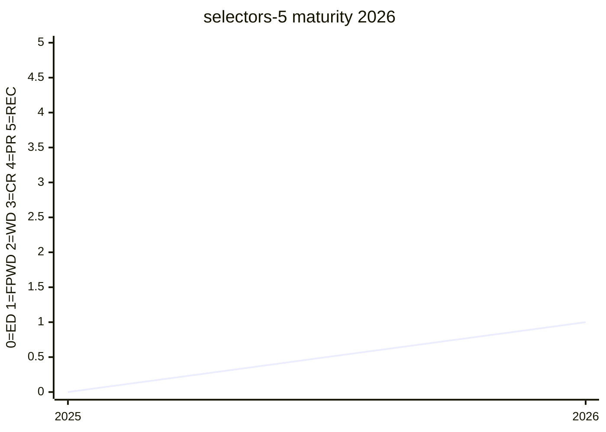

# Selectors Level 5

The current home for new selector proposals that are not stabilised into
[Selectors Level 4](https://www.w3.org/TR/selectors-4/). As Level 4 is being frozen to move
toward Recommendation, proposed features are re-tagged onto Level 5
([#12412](https://github.com/w3c/csswg-drafts/issues/12412#issuecomment-4558711489)). The
[`:heading()` selector](../features/heading-selector.md) lives here, in the `#headings`
section.

## Status history

From `raw/data/w3c-api/specifications/selectors-5.json` (snapshot 2026-07-04):

| Date | Status | TR version |
|---|---|---|
| 2026-02-17 | First Public Working Draft | https://www.w3.org/TR/2026/WD-selectors-5-20260217/ |

FPWD in February 2026 — the module is brand new; before that its features lived only in the
Editor's Draft.

## Features tracked here

- [:heading() Selector](../features/heading-selector.md)

---

*This page is an unofficial, LLM-maintained synthesis. It is not a product of
the CSS Working Group. Verify against the linked primary sources.*
